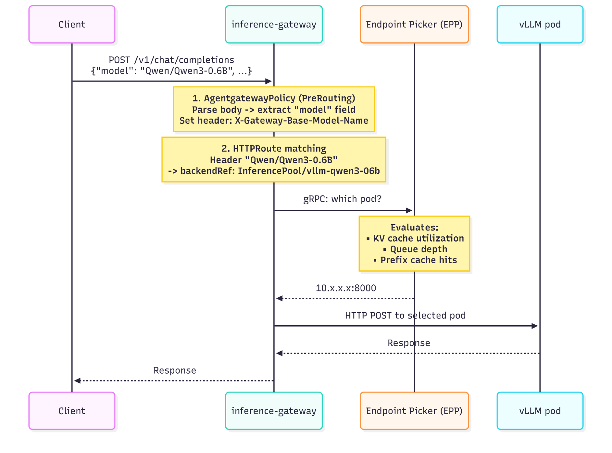

# Models-as-a-Service for multiple LLMs on OpenShift

Production-ready deployment manifests for running multiple large language models on OpenShift with llm-d inference framework and Gateway API routing.

> **Based on:** [Run Model-as-a-Service for Multiple LLMs on OpenShift](https://developers.redhat.com/articles/2026/03/24/run-model-service-multiple-llms-openshift) - Red Hat Developer Blog

## Overview

This repository contains manifests to deploy large language models and embedding models using:

- **llm-d** (Kubernetes-native distributed LLM inference framework)
- **vLLM** serving backend
- **Gateway API Inference Extension** for model routing
- **agentgateway** for body-based routing

### Deployed Models

| Model | Family | Params | Quant | Tool Parser | Manifests |
|-------|--------|--------|-------|-------------|-----------|
| [google/gemma-4-26B-A4B-it](https://huggingface.co/google/gemma-4-26B-A4B-it) | Gemma 4 | 26B (A4B) | FP16 | gemma4 | [manifests](manifests/gemma-4-26b-a4b-google/) |
| [RedHatAI/gemma-4-26B-A4B-it-FP8-Dynamic](https://huggingface.co/RedHatAI/gemma-4-26B-A4B-it-FP8-Dynamic) | Gemma 4 | 26B (A4B) | FP8 | gemma4 | [manifests](manifests/gemma-4-26b-a4b/) |
| [RedHatAI/gemma-4-31B-it-FP8-block](https://huggingface.co/RedHatAI/gemma-4-31B-it-FP8-block) | Gemma 4 | 31B | FP8 | gemma4 | [manifests](manifests/gemma-4-31b/) |
| [ibm-granite/granite-4.0-h-small](https://huggingface.co/ibm-granite/granite-4.0-h-small) | Granite 4.0 | 32B (9B active) | FP16 | granite4 | [manifests](manifests/granite-4-h-small/) |
| [ibm-granite/granite-4.1-30b-fp8](https://huggingface.co/ibm-granite/granite-4.1-30b-fp8) | Granite 4.1 | 30B | FP8 | granite4 | [manifests](manifests/granite-41-30b-fp8/) |
| [ibm-granite/granite-4.1-8b-fp8](https://huggingface.co/ibm-granite/granite-4.1-8b-fp8) | Granite 4.1 | 8B | FP8 | granite4 | [manifests](manifests/granite-41-8b-fp8/) |
| [Jackrong/Qwen3.5-27B-Claude-4.6-Opus-Reasoning-Distilled](https://huggingface.co/Jackrong/Qwen3.5-27B-Claude-4.6-Opus-Reasoning-Distilled) | Qwen 3.5 | 27B | FP16 | hermes | [manifests](manifests/qwen35-27b-distilled/) |
| [Qwen/Qwen3.5-35B-A3B](https://huggingface.co/Qwen/Qwen3.5-35B-A3B) | Qwen 3.5 | 35B (A3B) | FP16 | hermes | [manifests](manifests/qwen35-35b-a3b/) |
| [Qwen/Qwen3.5-9B](https://huggingface.co/Qwen/Qwen3.5-9B) | Qwen 3.5 | 9B | FP16 | hermes | [manifests](manifests/qwen35-9b/) |
| [Qwen/Qwen3-Next-80B-A3B-Thinking](https://huggingface.co/Qwen/Qwen3-Next-80B-A3B-Thinking) | Qwen 3 | 80B (A3B) | FP8 | hermes | [manifests](manifests/qwen3-next-80b/) |
| [sentence-transformers/all-mpnet-base-v2](https://huggingface.co/sentence-transformers/all-mpnet-base-v2) | MPNet | 110M | FP32 | — | [manifests](manifests/all-mpnet-base-v2/) |

Each model folder contains deployment manifests and model-specific README with deployment instructions.

## Architecture



The deployment uses Gateway API with body-based routing to direct requests to different model servers:

- **OpenShift Route** → **agentgateway** → **Gateway API HTTPRoutes**
- Body-based routing by `model` field in JSON request
- Each model runs in its own InferencePool with dedicated vLLM decode pod
- Separate TEI deployment for embeddings (CPU, no GPU required)

### Key Design Decisions

- **No Prefill/Decode Disaggregation**: Single-GPU deployments don't benefit from P/D splitting (requires 8+ GPUs with RDMA)
- **Decode-only mode**: Prefill pods disabled (`prefill.create: false`) - all inference runs through decode pods
- **PVC-based model storage**: Models pre-downloaded to RWO PersistentVolumeClaims for fast startup
- **FP8 quantization for 80B**: Qwen3-Next-80B uses FP8-dynamic for memory efficiency
- **vLLM version selection**: Each model family may require specific vLLM versions and Docker images
- **Tool calling**: Qwen models use `hermes` parser, Gemma 4 uses `gemma4` parser

## Prerequisites

### Required Components

1. **OpenShift 4.14+** with GPU Operator
2. **Gateway API CRDs** v1.2.0+
3. **Gateway API Inference Extension** v1.3.0
4. **agentgateway** (llm-d's custom Gateway API implementation)
5. **llm-d-modelservice Helm chart** v0.4.8+
6. **HuggingFace account** with access token (for model downloads)

### Install Gateway API Components

```bash
# 1. Install GAIE CRDs
oc apply -k https://github.com/kubernetes-sigs/gateway-api-inference-extension/config/crd/?ref=v1.3.0

# 2. Install agentgateway CRDs + control plane
# This is safe on OpenShift 4.19 - does NOT install gateway.networking.k8s.io CRDs
helmfile apply -f guides/prereq/gateway-provider/agentgateway.helmfile.yaml
```

> **Note**: If `guides/` directory is not available, install agentgateway manually via Helm. See [llm-d documentation](https://llm-d.ai/docs/guide/Installation/prerequisites/).

## Deployment

### Step 1: Environment Setup

```bash
export NAMESPACE=llm-d
export MODEL_SERVER=vllm
export IGW_CHART_VERSION=v1.3.0
export HF_TOKEN=<your-huggingface-token>

# Create namespace
oc create namespace ${NAMESPACE} || true

# Create HuggingFace token secret
oc create secret generic llm-d-hf-token \
  --from-literal="HF_TOKEN=${HF_TOKEN}" \
  --namespace ${NAMESPACE}
```

### Step 2: Deploy Shared Gateway Infrastructure

```bash
# Deploy agentgateway Gateway
oc apply -f manifests/shared/gateway.yaml

# Apply SCC binding for non-root vLLM containers
oc apply -f manifests/shared/scc-binding.yaml

# Wait for agentgateway data plane
oc rollout status deployment -n agentgateway-system

# Apply body-based routing policy
oc apply -f manifests/shared/agentgateway-policy.yaml

# Expose Gateway via OpenShift Route
oc apply -f manifests/shared/route.yaml

# Get Gateway URL
export GATEWAY_URL=$(oc get route inference-gateway -n agentgateway-system -o jsonpath='{.spec.host}')
echo "Gateway URL: https://${GATEWAY_URL}"
```

### Step 3: Deploy Models

For each model you want to deploy, navigate to its folder and follow the deployment instructions in its README.md:

**Generic deployment pattern for all models:**

1. **Create PVC**: `oc apply -f pvc.yaml`
2. **Download model**: `oc apply -f download.yaml` → wait → delete download pod
3. **Deploy InferencePool**: Helm install with model-specific `baseModel` parameter
4. **Deploy model server**: `helm install -f values.yaml`
5. **Patch HTTPRoute**: Add Gateway namespace reference
6. **Update AgentgatewayPolicy**: Add model to routing map (if not already present)
7. **Test**: Use model-specific test commands

See individual model READMEs for exact commands, storage sizes, and configuration details.

### Step 4: Scale Management

To free GPU resources when models are not in use:

```bash
# Stop all models
oc scale deployment -l helm.sh/chart=llm-d-modelservice-v0.4.9 --replicas=0 -n ${NAMESPACE}

# Start all models
oc scale deployment -l helm.sh/chart=llm-d-modelservice-v0.4.9 --replicas=1 -n ${NAMESPACE}
```

## Verification

### Check Deployment Status

```bash
# View all pods
oc get pods -n ${NAMESPACE}

# Check InferencePools and HTTPRoutes
oc get inferencepool,httproute -n ${NAMESPACE}

# Verify model server readiness
oc get pods -n ${NAMESPACE} -l llm-d.ai/role=decode -o wide
```

### List Deployed Models

**Note**: `GET /v1/models` returns 404 through the gateway because the AgentgatewayPolicy CEL expression requires a JSON body with a `model` field for routing.

Query model servers directly:

```bash
# List InferencePools
oc get inferencepool -n ${NAMESPACE}

# Query specific model server
oc get pods -n ${NAMESPACE} -l app=vllm-gemma-4-31b -o name | head -1 | \
  xargs -I{} oc exec {} -c vllm -- curl -s http://localhost:8200/v1/models | jq -r '.data[].id'
```

### Test Inference

```bash
# Set Gateway URL
export GATEWAY_URL=$(oc get route inference-gateway -n agentgateway-system -o jsonpath='{.spec.host}')

# Test any deployed model (example: Gemma 4 31B)
curl -s -X POST https://${GATEWAY_URL}/v1/chat/completions \
  -H "Content-Type: application/json" \
  -d '{
    "model": "RedHatAI/gemma-4-31B-it-FP8-block",
    "messages": [{"role": "user", "content": "Hello"}],
    "max_tokens": 100
  }' | jq .
```

**For model-specific test commands**, see the model's README.md in `manifests/<model-name>/`.

## Troubleshooting

### Common Issues

#### 1. Prefill pods showing "max context length 1024" errors

**Symptom**: Logs show `max context length is 1024 tokens` errors.

**Cause**: Prefill pods are running the `llm-d-inference-sim` (simulator) instead of vLLM.

**Fix**: Ensure all model values files have `prefill: { create: false }`. This disables P/D disaggregation (not needed for single-GPU deployments).

#### 2. vLLM permission errors on OpenShift

**Symptom**: Logs show errors like `/.triton: Permission denied` or `/.cache: Permission denied`.

**Cause**: OpenShift runs containers as non-root (random UID). vLLM tries to write to home directory.

**Fix**: Set `HOME=/tmp` in container environment (already configured in values files).

#### 3. RWO PVC claim failures

**Symptom**: Model server pods stuck in `Pending` with "PVC already in use" error.

**Cause**: Download pod still claims the RWO PVC.

**Fix**: Delete download pods after model downloads complete:

```bash
oc delete pod download-<model-name> -n ${NAMESPACE}
```

#### 4. HTTPRoute not routing traffic

**Symptom**: Requests return 404 or "no matching route".

**Cause**: HTTPRoute missing `parentRefs[0].namespace` field.

**Fix**: Apply the HTTPRoute patch:

```bash
oc patch httproute vllm-<model-name> -n ${NAMESPACE} --type='json' \
  -p='[{"op":"add","path":"/spec/parentRefs/0/namespace","value":"agentgateway-system"}]'
```

### Debug Commands

```bash
# Check vLLM logs
oc logs -f deployment/ms-<model-name>-llm-d-modelservice-decode -c vllm -n ${NAMESPACE}

# Check Gateway routing
oc describe httproute vllm-<model-name> -n ${NAMESPACE}

# Check InferencePool status
oc describe inferencepool vllm-<model-name> -n ${NAMESPACE}

# Test direct pod access (bypass gateway)
POD=$(oc get pods -n ${NAMESPACE} -l app=vllm-<model-name> -o name | head -1)
oc exec ${POD} -c vllm -- curl -s http://localhost:8200/v1/models | jq .

# Check AgentgatewayPolicy includes the model
oc get agentgatewaypolicy bbr -n agentgateway-system -o jsonpath='{.spec.traffic.transformation.request.set[0].value}'
```

## Configuration Details

### Model Server Configuration

Common vLLM arguments across models:

- `--enable-auto-tool-choice` - Auto-detect tool calling
- `--tool-call-parser` - Tool format parser (varies by model family)
- `--disable-access-log-for-endpoints /health,/metrics,/ping` - Reduce log noise
- `--trust-remote-code` - Allow custom model code
- `HOME=/tmp` environment variable for non-root compatibility

### Tool Calling Support

- **Qwen models**: `--tool-call-parser hermes`
- **Gemma 4 models**: `--tool-call-parser gemma4`
- **Granite 4 models**: `--tool-call-parser granite4`

See model-specific READMEs for tool calling test examples.

### Chart Versions

- **llm-d-modelservice**: v0.4.8+
- **Gateway API Inference Extension**: v1.3.0
- **vLLM images**: Model-specific (see individual README.md files)

## Cleanup

### Remove All Deployments

```bash
export NAMESPACE=llm-d

# Delete all model servers
helm uninstall $(helm list -n ${NAMESPACE} -q | grep ^ms-) -n ${NAMESPACE}

# Delete all InferencePools
helm uninstall $(helm list -n ${NAMESPACE} -q | grep ^vllm-) -n ${NAMESPACE}

# Delete embedding service (if deployed)
oc delete -f manifests/all-mpnet-base-v2/ 2>/dev/null || true

# Delete Gateway resources
oc delete -f manifests/shared/

# Delete PVCs (WARNING: deletes downloaded models)
oc delete pvc -l app.kubernetes.io/managed-by=Helm -n ${NAMESPACE}

# Delete namespace
oc delete namespace ${NAMESPACE}
```

### Keep PVCs (Fast Re-deployment)

To keep downloaded models but remove running services:

```bash
# Stop model servers only
helm uninstall $(helm list -n ${NAMESPACE} -q | grep ^ms-) -n ${NAMESPACE}

# PVCs remain - next deployment will skip downloads
```

## Embedding Model (TEI)

The `sentence-transformers/all-mpnet-base-v2` model runs on HuggingFace TEI as a standalone CPU deployment (vLLM does not support MPNetModel architecture).

See [manifests/all-mpnet-base-v2/README.md](manifests/all-mpnet-base-v2/) for deployment and testing instructions.

## References

- [llm-d Documentation](https://llm-d.ai/)
- [llm-d-modelservice Chart](https://llm-d-incubation.github.io/llm-d-modelservice/)
- [Gateway API Inference Extension](https://github.com/kubernetes-sigs/gateway-api-inference-extension)
- [vLLM Documentation](https://docs.vllm.ai/)
- [vLLM Model Recipes](https://docs.vllm.ai/projects/recipes/en/latest/index.html)
- [vLLM Tool Calling Guide](https://docs.vllm.ai/en/latest/features/tool_calling/)
- [Qwen Models on HuggingFace](https://huggingface.co/Qwen)
- [Gemma 4 Models on HuggingFace](https://huggingface.co/google)

## License

These deployment manifests are provided as-is for reference. Individual components (llm-d, vLLM, models) have their own licenses.

## Contributing

Issues and improvements welcome! Please test changes on a non-production cluster first.
